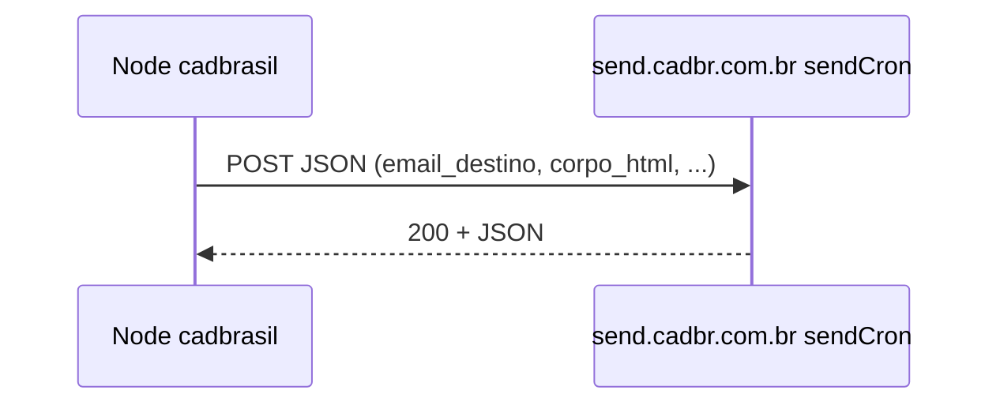

# Envio de e-mail — API externa (`send.cadbr.com.br`)

Este projeto **não envia SMTP direto** do Node. Toda fila/disparo passa por uma **API HTTP** configurável, com padrão:

```text
https://send.cadbr.com.br/sendCron
```

**Implementação:** `server/services/email.js`  
**Variável de ambiente:** `EMAIL_API_URL` (se ausente ou inválida, usa a URL acima; se contiver `your-`, o serviço trata como não configurado e não envia).

---

## 1. Contrato HTTP com a API

| Item | Valor |
|------|--------|
| **Método** | `POST` |
| **URL** | Valor de `process.env.EMAIL_API_URL` ou `https://send.cadbr.com.br/sendCron` |
| **Headers** | `Content-Type: application/json`, `Accept: application/json` |
| **Body** | JSON único (objeto abaixo) |
| **Autenticação** | **Não** há header de API key ou Bearer no código atual — se a API em produção exigir token, será necessário estender `server/services/email.js`. |

### 1.1. Corpo JSON (payload padrão)

Todos os envios atuais montam o mesmo **formato de objeto**:

| Campo | Tipo | Obrigatório no código | Descrição |
|-------|------|------------------------|-----------|
| `email_destino` | string | Sim | Destinatário. |
| `nome_destino` | string | Sim | Nome exibido / identificação do destinatário (no cadastro ao cliente usa **razão social**). |
| `assunto` | string | Sim | Assunto da mensagem. |
| `corpo_html` | string | Sim | HTML do e-mail. |
| `corpo_texto` | string | Sim | Versão texto plano (fallback). |
| `prioridade` | number | Sim | Sempre **`1`** no código (comentário no fonte: 1 = mais alta, 5 = mais baixa). |
| `max_tentativas` | number | Sim | Sempre **`3`**. |
| `id_dominio` | null | Sim | Sempre **`null`** (“rotação automática” de domínio remetente, conforme comentário). |
| `data_agendamento` | null | Sim | Sempre **`null`** (envio imediato). |

Exemplo genérico:

```json
{
  "email_destino": "destinatario@exemplo.com",
  "nome_destino": "Nome ou Empresa",
  "assunto": "Assunto do e-mail",
  "corpo_html": "<html>...</html>",
  "corpo_texto": "Versão texto",
  "prioridade": 1,
  "max_tentativas": 3,
  "id_dominio": null,
  "data_agendamento": null
}
```

### 1.2. Resposta esperada

O código chama `await response.json()` após verificar `response.ok`. Ou seja, a API deve responder **2xx** com corpo **JSON** (formato livre; só é logado como `result`).

Se `!response.ok`, o texto bruto da resposta entra na mensagem de erro (`await response.text()`).

---

## 2. Variáveis de ambiente relacionadas

| Variável | Uso |
|----------|-----|
| **`EMAIL_API_URL`** | URL completa do endpoint (ex.: `https://send.cadbr.com.br/sendCron`). |
| **`EMAIL_NOTIFICATION_EMAIL`** | Destino do e-mail de **notificação interna** de novo cadastro; também fallback do **formulário de contato** se `CONTACT_FORM_EMAIL` não existir. |
| **`CONTACT_FORM_EMAIL`** | Se definido, tem **prioridade** sobre `EMAIL_NOTIFICATION_EMAIL` como destino do formulário de contato. |

Se `EMAIL_API_URL` contiver a substring **`your-`**, o serviço considera a API “não configurada” e **não** chama `fetch` (útil para placeholders em `.env` de exemplo).

---

## 3. Funções de envio no sistema

### 3.1. `enviarEmailCadastro(dados)`

**Arquivo:** `server/services/email.js`  
**Chamada:** `server/routes/cadastro.js`, após `POST /api/cadastro` concluir com sucesso (`.catch` no route — falha de e-mail **não** altera o HTTP 201).

**Parâmetros usados** (objeto `dados`):

- `emailResponsavel`, `nomeResponsavel`, `razaoSocial`, `protocolo`, `tipoServico`

**Observação:** o route também passa `template` e `configuracoes` (vindos de `templates_email` e `configuracoes_sistema`), mas **`enviarEmailCadastro` ignora esses campos** — o HTML/texto são gerados só pelas funções internas `getEmailHTMLBody` / `getEmailTextBody`.

**Assunto gerado:**

```text
Boas vindas - Sistema CADBRASIL SICAF - <hora pt-BR>
```

**Destino:** `email_destino = emailResponsavel`, `nome_destino = razaoSocial`.

**Erros:** relança `throw` após `console.error` (o caller no cadastro só registra no `.catch`).

---

### 3.2. `enviarEmailNotificacao(dados)`

**Chamada:** mesmo `POST /api/cadastro`, apenas se `aceitaNotificacoes` for verdadeiro no body.

**Requisito:** `EMAIL_NOTIFICATION_EMAIL` definido.

**Parâmetros:** `razaoSocial`, `cnpj` (no route é o campo `documento` — CPF ou CNPJ), `protocolo`, `tipoServico`, `emailResponsavel`.

**Assunto:** `[CADBRASIL] Novo Cadastro - ${protocolo}`

**Destino:** `email_destino = EMAIL_NOTIFICATION_EMAIL`, `nome_destino = "Equipe CADBRASIL"`.

**Erros:** retorna `{ success: false, error }` sem relançar (diferente do cadastro ao cliente).

---

### 3.3. `enviarEmailContato(dados)`

**Chamada:** `POST /api/contato` em `server/routes/cadastro.js` (`await enviarEmailContato(...)` — falha **falha** a requisição de contato).

**Destino:** `CONTACT_FORM_EMAIL` **ou** `EMAIL_NOTIFICATION_EMAIL`.

**Parâmetros:** `nome`, `email`, `telefone`, `empresa`, `assunto`, `mensagem` (campos do body validados no route).

**Assunto:** `[CADBRASIL Contato] ` + primeiros 80 caracteres do assunto (ou texto fixo se vazio).

**Segurança:** nomes e textos passam por `escapeHtml` no HTML; quebras de linha da mensagem viram `<br>` no HTML.

**Erros:** relança `throw`.

---

## 4. Onde configurar em produção

Referências já existentes no repositório:

- `DEPLOY.md`, `docs/GUIA_PRODUCAO.md`, `docs/ARQUIVOS_PARA_PRODUCAO.md` — exemplo `EMAIL_API_URL=https://send.cadbr.com.br/sendCron`
- `server/README.md` — descrição curta de `EMAIL_API_URL`

Exemplo mínimo no `.env` do **servidor**:

```env
EMAIL_API_URL=https://send.cadbr.com.br/sendCron
EMAIL_NOTIFICATION_EMAIL=operacoes@suaempresa.com.br
# Opcional: destino exclusivo do formulário /contato
# CONTACT_FORM_EMAIL=contato@suaempresa.com.br
```

---

## 5. Teste manual com `curl`

Substitua URL e e-mail; o corpo deve seguir o schema da seção 1.1.

```bash
curl -sS -X POST "https://send.cadbr.com.br/sendCron" \
  -H "Content-Type: application/json" \
  -H "Accept: application/json" \
  -d "{\"email_destino\":\"seu-email@exemplo.com\",\"nome_destino\":\"Teste API\",\"assunto\":\"Teste CADBRASIL Node\",\"corpo_html\":\"<p>HTML</p>\",\"corpo_texto\":\"Texto\",\"prioridade\":1,\"max_tentativas\":3,\"id_dominio\":null,\"data_agendamento\":null}"
```

Se a API exigir autenticação adicional, este comando precisará dos mesmos headers que o time do `send.cadbr.com.br` documentar.

---

## 6. Fluxo resumido



| Origem no produto | Função | Endpoint Node |
|-------------------|--------|----------------|
| Cadastro concluído | `enviarEmailCadastro` | `POST /api/cadastro` |
| Cadastro + aceite notificações | `enviarEmailNotificacao` | `POST /api/cadastro` |
| Página contato | `enviarEmailContato` | `POST /api/contato` |

---

## 7. Evoluções possíveis (não implementadas)

- Usar `template.corpo_html` de `templates_email` no lugar do HTML fixo de boas-vindas.
- Aplicar SMTP/remetente a partir de `configuracoes_sistema` se a API aceitar campos extras.
- Header de API key para `sendCron`, se a infraestrutura exigir.

---

*Documento baseado em `server/services/email.js` e chamadas em `server/routes/cadastro.js`. Em caso de divergência com o serviço real em `send.cadbr.com.br`, prevalece a documentação da API de envio.*
