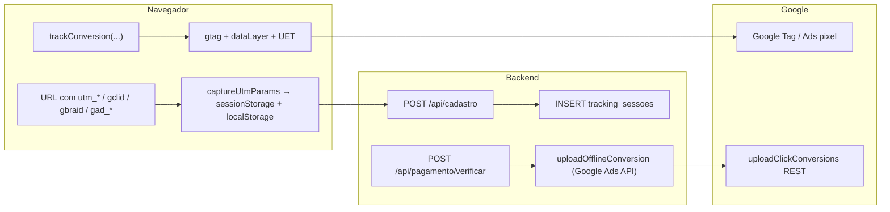

# Google Ads — tracking, conversões e tabelas

Mapeamento do ecossistema de atribuição e conversão ligado ao Google Ads neste repositório: **navegador (gtag/GTM)**, **armazenamento local (UTM/gclid)**, **persistência em banco** e **API de conversão offline**.

**Arquivos principais**

| Camada | Arquivo |
|--------|---------|
| Snippets globais (gtag, GTM, Microsoft UET) | `index.html` |
| Captura UTM / gclid e eventos no cliente | `src/lib/utm.ts` |
| Disparo inicial da captura | `src/App.tsx` (import + `captureUtmParams()` no load do bundle) |
| Cadastro: envio dos parâmetros ao backend | `src/pages/Cadastro.tsx` → `getUtmForPayload()` + `POST /api/cadastro` |
| Contato: evento de conversão no browser | `src/pages/Contato.tsx` → `trackConversion("contato_enviado")` |
| Gravação no MySQL + conversão offline (pagamento) | `server/routes/cadastro.js` |
| Upload de conversão offline (Google Ads API) | `server/services/google-ads-conversion.js` |
| DDL da tabela de sessões | `scripts/SQL_SISTEMA_NOVO.SQL` (`tracking_sessoes`, `tracking_eventos`) |

Documentação relacionada: [CADASTRO_PORTAL_FLUXO_E_TABELAS.md](./CADASTRO_PORTAL_FLUXO_E_TABELAS.md).

---

## 1. Visão geral em camadas



- **Atribuição no site:** UTMs e identificadores de clique são guardados no cliente e reenviados no cadastro para **`tracking_sessoes`**.
- **Conversão “online” no browser:** `gtag('event', ...)` e pushes no `dataLayer` (GTM) quando o fluxo conclui (ex.: cadastro).
- **Conversão offline na API Google:** usada hoje no fluxo de **pagamento confirmado** (`tbl_smart_*`), com `gclid` e/ou e-mail/telefone hasheados — não no `POST /api/cadastro` do schema novo.

---

## 2. Navegador: tags instaladas (`index.html`)

| Tag | ID / observação |
|-----|------------------|
| **Google Tag Manager** | `GTM-TRVTMS6M` — injeta `dataLayer` |
| **Google Ads (gtag)** | `AW-16460586067` — `gtag('config', 'AW-16460586067')` |
| **Google Tag adicional** | `GT-KTPDP2TV` — segundo `gtag('config', ...)` |
| **Microsoft Ads UET** | `ti: "343231769"` |

O cadastro e outros eventos usam o mesmo **conversion label** implícito via `send_to: "AW-16460586067"` em código (sem label separado no `trackConversion` atual — apenas o ID da conta de conversão).

---

## 3. Cliente: captura e persistência de UTMs (`src/lib/utm.ts`)

### 3.1. Quando roda

`captureUtmParams()` é executada **uma vez** ao carregar o app (`src/App.tsx`, antes do `BrowserRouter`), para pegar a URL inicial (incluindo parâmetros após `#` em alguns redirecionamentos).

### 3.2. O que é capturado

Chave de storage: **`cadbrasil_utm`** (sessionStorage e localStorage).

| Campo persistido | Origem |
|------------------|--------|
| `utm_source`, `utm_medium`, `utm_campaign`, `utm_term`, `utm_content` | Query string |
| `gclid`, `gbraid`, `gad_source`, `gad_campaignid` | Query string (Google Ads / iOS / auto-tag) |
| `landing_page` | `pathname + search` no momento da captura |
| `referrer` | `document.referrer` |
| `captured_at` | ISO timestamp |

**Heurística:** se existir `gclid`, `gad_source` ou `gbraid` mas faltar `utm_source` / `utm_medium`, preenche automaticamente `utm_source = "google"` e `utm_medium = "cpc"`. `utm_campaign` pode vir de `utm_campaign` ou `gad_campaignid`.

### 3.3. Uso no cadastro

`getUtmForPayload()` devolve objeto plano (strings vazias se não houver dados) para merge no body do **`POST /api/cadastro`** (`src/pages/Cadastro.tsx`).

### 3.4. Eventos de conversão no browser (`trackConversion`)

Função: `trackConversion(eventName, value?, extraParams?)`.

- **Google Ads:** se `window.gtag` existir, chama `gtag('event', eventName, { send_to: 'AW-16460586067', value, currency: 'BRL', keyword, campaign, source, gclid, ...extra })` com dados vindos de `getUtmParams()` quando disponíveis.
- **GTM:** `dataLayer.push({ event: eventName, conversionValue, currency, utm*, gclid })`.
- **Microsoft:** `uetq.push('event', eventName, { revenue_value, currency })`.

**Onde é chamado hoje**

| Página / fluxo | Evento | Valor BRL |
|----------------|--------|-----------|
| `Cadastro.tsx` — após sucesso | `cadastro_concluido` | `985` |
| `Contato.tsx` — após envio | `contato_enviado` | (omitido) |

**Importante:** isso **não grava linha no MySQL** por si só; só dispara tags no navegador. A gravação estruturada no banco novo ocorre no **`tracking_sessoes`** no backend, no cadastro.

---

## 4. Backend: cadastro e tabela `tracking_sessoes`

### 4.1. Endpoint

**`POST /api/cadastro`** (`server/routes/cadastro.js`)

O body pode incluir (entre outros) os campos de tracking listados na documentação de cadastro. O servidor normaliza com `str()` e grava em variáveis `utmSource`, `utmMedium`, etc.

### 4.2. INSERT executado (subset da tabela)

Dentro da mesma transação do cadastro, após criar usuário e cliente, há um **`try/catch`** que executa:

```sql
INSERT INTO tracking_sessoes (
  session_id, cliente_id, usuario_id, utm_source, utm_medium, utm_campaign, utm_term, utm_content,
  gclid, gbraid, gad_source, landing_page, referrer, user_agent, converted, conversion_type, conversion_at,
  funnel_step, last_activity_at
) VALUES (?, ?, ?, ?, ?, ?, ?, ?, ?, ?, ?, ?, ?, ?, 1, 'signup', NOW(), 'signup', NOW())
```

| Coluna | Valor no código |
|--------|-----------------|
| `session_id` | `randomUUID()` (Node `crypto`) — **UUID gerado no servidor** neste fluxo |
| `cliente_id`, `usuario_id` | IDs recém-inseridos |
| `utm_campaign` | `utm_campaign` do body **ou**, se vazio, `gad_campaignid` do body |
| `gclid`, `gbraid`, `gad_source` | Do body |
| `landing_page`, `referrer` | Do body |
| `user_agent` | `req.get('user-agent')` |
| `converted` | `1` |
| `conversion_type` | `'signup'` |
| `conversion_at`, `funnel_step`, `last_activity_at` | `NOW()` / `'signup'` |

Se o `INSERT` falhar (schema incompatível, coluna inexistente, etc.), o erro é apenas logado (`console.warn`); **não** é relançado — o cadastro principal já está na mesma transação: em teoria, se `tracking_sessoes` falhar com erro fatal **antes** do commit, a transação inteira falharia; na prática o código envolve só o insert de tracking em `try/catch` **sem** `throw`, então o fluxo segue para `commit`. (Se o MySQL propagar erro fora do catch interno, comportamento depende do driver; o intent do código é não abortar por tracking.)

### 4.3. Colunas da tabela **não** preenchidas por este INSERT

O script `SQL_SISTEMA_NOVO.SQL` define muitas colunas adicionais em `tracking_sessoes`; o `POST /api/cadastro` **não** as popula hoje:

- `wbraid`, `fbclid`, `msclkid`
- `exit_page`
- `device_type`, `browser`, `browser_version`, `os`, `os_version`, `screen_resolution`, `viewport_size`, `language`
- `ip_address`, `geo_*`
- `pages_viewed`, `session_duration`, `bounce`, `scroll_depth_max`
- `conversion_value` (permanece default `NULL` neste insert)

Ou seja: o modelo permite evolução (sessão completa + funil); o cadastro só grava a **linha mínima de atribuição + conversão signup**.

---

## 5. Tabela `tracking_eventos` (schema apenas)

Definida em `scripts/SQL_SISTEMA_NOVO.SQL` com FK `sessao_id` → `tracking_sessoes.id`.

**No código da aplicação atual não há `INSERT` em `tracking_eventos`** (apenas o DDL). Qualquer granularidade de eventos por página continua a cargo do GTM/dataLayer no browser, até existir backend que persista nessa tabela.

---

## 6. Google Ads API: conversão offline (`server/services/google-ads-conversion.js`)

### 6.1. Finalidade

Enviar conversões para o Google Ads via **`uploadClickConversions`** (REST `v19`), para atribuir conversões a cliques (`gclid`) e/ou identidades hasheadas (e-mail, telefone), conforme [documentação oficial de upload offline](https://developers.google.com/google-ads/api/docs/conversions/upload-offline).

### 6.2. Onde é chamado no projeto

| Fluxo | Arquivo | Gatilho |
|-------|---------|---------|
| Pagamento PIX confirmado | `server/routes/cadastro.js` — `POST /api/pagamento/verificar` | Após `UPDATE` do pedido, se `GOOGLE_ADS_CONVERSION_ENABLED === 'true'` |

**Não** é chamado no **`POST /api/cadastro`** do schema novo (apenas `tracking_sessoes` + gtag no cliente).

### 6.3. Variáveis de ambiente

| Variável | Uso |
|----------|-----|
| `GOOGLE_ADS_CUSTOMER_ID` | Customer ID sem hífens |
| `GOOGLE_ADS_DEVELOPER_TOKEN` | Header `developer-token` |
| `GOOGLE_ADS_CLIENT_ID` | OAuth2 |
| `GOOGLE_ADS_CLIENT_SECRET` | OAuth2 |
| `GOOGLE_ADS_REFRESH_TOKEN` | OAuth2 → access token |
| `GOOGLE_ADS_CONVERSION_ACTION_ID` | Recurso `conversionActions/{id}` |
| `GOOGLE_ADS_CONVERSION_ENABLED` | Deve ser exatamente `'true'` (trim + lowercase) para rodar o upload no fluxo de pagamento |

Se faltar customer / developer token / conversion action id, a função retorna `{ success: false }` e loga aviso, sem lançar exceção para o caller.

### 6.4. Payload enviado ao Google (resumo)

- `conversionAction`, `conversionDateTime`, `conversionValue`, `currencyCode: BRL`
- `gclid` (opcional)
- `orderId` (ex.: protocolo)
- `userIdentifiers`: e-mail e telefone **normalizados e SHA-256**, quando fornecidos
- `consent`: `adUserData` e `adPersonalization` = `GRANTED`

---

## 7. Fluxo legado: tabelas `tbl_smart_*` e Google Ads

Usado em **`POST /api/pagamento/verificar`** quando o PIX é confirmado (`consultarPix` retorna cobrança paga).

### 7.1. Escrita (não é tracking Google em si)

| Tabela | Operação |
|--------|----------|
| **`tbl_smart_pedido_credenciamento`** | `UPDATE` — `DataAtualizadoFinanceiro = NOW()`, `IdStatus = 14` onde `IdPedido = ?` |

### 7.2. Leitura para conversão offline

Join:

```text
tbl_smart_pedido_credenciamento p
INNER JOIN tbl_smart_clientes c ON p.IdCliente = c.IdCliente
```

Colunas lidas de **`tbl_smart_clientes`** (e relacionadas ao pedido):

| Coluna | Uso |
|--------|-----|
| `gclid` | Enviado para `uploadOfflineConversion` |
| `Email` | Hash + upload (conversões otimizadas) |
| `TelefoneCelular` | Hash + upload |
| `ProtocoloCadbrasil` | `orderId` na conversão |
| `utm_source`, `utm_term` | Selecionados na query (útil para debug/analytics; **não** são enviados no body atual da API Google neste trecho) |

Condição para disparar o upload: `gadsEnabled` e (`cliente.gclid` **ou** `cliente.Email`).

**Nenhuma tabela é atualizada com o “retorno” do Google** após o upload; o sucesso/falha só vai para logs.

---

## 8. Resumo: o que grava informação de tracking

| Destino | O que grava | Momento |
|---------|-------------|---------|
| **sessionStorage / localStorage** (`cadbrasil_utm`) | UTMs, gclid, gbraid, gad_*, landing, referrer | Primeira carga do SPA com params na URL |
| **`tracking_sessoes`** (MySQL novo) | Linha com UTMs, gclid, cliente/usuário, `conversion_type = signup` | Sucesso do `POST /api/cadastro` (se o INSERT não falhar) |
| **`tracking_eventos`** | — | Não usado pelo código atual |
| **Google (browser)** | Eventos via gtag / dataLayer / UET | `trackConversion` e page load |
| **Google (API)** | Conversão offline de pagamento | `POST /api/pagamento/verificar` + env habilitado |
| **`tbl_smart_pedido_credenciamento`** | Status financeiro / pedido | Pagamento confirmado |
| **`tbl_smart_clientes`** | — (somente **leitura** neste fluxo para gclid/email/telefone) | Mesmo momento |

---

## 9. Checklist para nova tela / integração

1. Garantir que a aplicação chame **`captureUtmParams()`** cedo (ou equivalente) na nova shell.
2. No submit que substitui o cadastro, enviar os mesmos campos de tracking que `getUtmForPayload()` envia hoje (nomes em snake_case no JSON).
3. Para conversão no browser, reutilizar **`trackConversion`** ou replicar `gtag`/`dataLayer` com o mesmo `send_to` se a conta for a mesma.
4. Conversão offline via API: só no fluxo que tiver **`gclid`/e-mail** confiável e **ação de conversão** configurada no Google Ads; hoje isso está acoplado ao **pedido legado** pago, não ao cadastro novo isolado.

---

*Última revisão alinhada ao código em `src/lib/utm.ts`, `server/routes/cadastro.js`, `server/services/google-ads-conversion.js` e `scripts/SQL_SISTEMA_NOVO.SQL`.*
